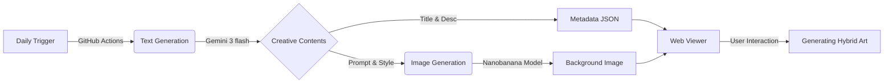

# Media Art Gallery: AI Virtual Artists

**"This is not just an image. It is a living artwork."**

9명의 AI 가상 작가(Virtual Artists)가 매일 새로운 미디어 아트를 창작하는 갤러리 프로젝트입니다.
정적인 이미지와 동적인 제너러티브 아트 코드가 결합된 **하이브리드 아트(Hybrid Art)**를 선보입니다.

## 🎨 9 Virtual Artists & Unique Skills

각 작가는 자신만의 세계관과 고유한 7가지 시각적 구현 스킬(**The 7 Modes**)을 보유하고 있습니다.

| Artist | Theme | Key Concept | Unique Styles |
|--------|-------|-------------|---------------|
| **NEON-V** | Cyberpunk | The Hacker | `Rain` `Scan` `Sniper` `Data` `Circ` `Sign` `Net` |
| **AURA-7** | Nature | The Gardener | `Seed` `Root` `Bloom` `Forest` `Wind` `Decay` `Life` |
| **KURO-X** | Geometric | The Architect | `Point` `Line` `Poly` `Solid` `Fractal` `Dim` `Chaos` |
| **VOID-3** | Cosmos | The Observer | `Dust` `Orbit` `Nova` `Void` `Galaxy` `Quasar` `Multi` |
| **AQUA-5** | Liquid | The Flow | `Drop` `Ripple` `Tide` `Bubble` `Deep` `Mist` `Ice` |
| **PRISM-2** | Light | The Optic | `Beam` `Spec` `Glass` `Bokeh` `Neon` `Mirror` `Flash` |
| **ECHO-0** | Sound | The Sonic | `Pulse` `Wave` `EQ` `Noise` `Voice` `String` `Silence` |
| **TERRA-1** | Geology | The Geologist | `Map` `Mount` `River` `Rock` `Sand` `Layer` `Core` |
| **FLORA-9** | Flower | The Florist | `Petal` `Bloom` `Bouquet` `Vine` `Pollen` `Garden` `Dry` |

총 **63가지(9x7)**의 서로 다른 인터랙티브 모드가 데이터에 따라 매일 다르게 조합됩니다.

## ⚙️ Automated Workflow

이 프로젝트는 100% 자동화된 파이프라인을 통해 운영됩니다.



1.  **Text Creation**: `Google Gemini 3 flash`가 오늘의 주제, 프롬프트, 작가 노트를 생성합니다.
2.  **Image Creation**: `Nanobanana` 모델이 프롬프트를 바탕으로 고품질 배경 이미지를 생성합니다.
3.  **Visualization**: 브라우저에서 `HTML5 Canvas` 기반의 자체 엔진이 이미지 위에 살아있는 효과를 렌더링합니다.

## 🚀 How to Run

### Local Development
1. Clone repository
2. Open `index.html` with Live Server

### Manual Generation
```bash
# Generate daily artwork manually
node scripts/generate.js --date=2026-01-26
```

## 🛠 Tech Stack
- **Frontend**: Vanilla JS, HTML5 Canvas, CSS3
- **AI Models**: Google Gemini 3 flash (Text), Nanobanana (Image)
- **Automation**: GitHub Actions, Node.js

---
© 2026 Media Art Gallery. All rights reserved.
