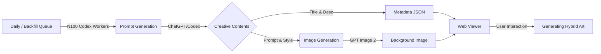

# Media Art Gallery: AI Virtual Artists

**"This is not just an image. It is a living artwork."**

[](https://hiyong7759.github.io/media-art-writer/)

9명의 AI 가상 작가(Virtual Artists)가 매일 새로운 미디어 아트를 창작하는 갤러리 프로젝트입니다.
정적인 이미지와 동적인 제너러티브 아트 코드가 결합된 **하이브리드 아트(Hybrid Art)**를 선보입니다.

## 🎨 9 Virtual Artists & Unique Skills

각 작가는 자신만의 세계관과 고유한 7가지 시각적 구현 스킬(**The 7 Modes**)을 보유하고 있습니다.

| Artist | Theme | Key Concept | Unique Styles |
|--------|-------|-------------|---------------|
| **NEON-V** | Cyberpunk | The Hacker | `Rain` `Scanner` `HUD` `Data` `Circuit` `Sign` `Net` |
| **AURA-7** | Nature | The Druid | `Flow` `Seed` `Wind` `Bloom` `Root` `Pulse` `Life` |
| **KURO-X** | Geometric | The Architect | `Poly` `Point` `Line` `Solid` `Fractal` `Dim` `Chaos` |
| **VOID-3** | Cosmos | The Observer | `Dust` `Orbit` `Nova` `Void` `Galaxy` `Quasar` `Multi` |
| **AQUA-5** | Liquid | The Flow | `Bubble` `Drop` `Ripple` `Tide` `Deep` `Mist` `Ice` |
| **PRISM-2** | Light | The Optic | `Beam` `Spectrum` `Glass` `Bokeh` `Neon` `Mirror` `Flash` |
| **ECHO-0** | Sound | The Sonic | `Wave` `Pulse` `EQ` `Noise` `Voice` `String` `Silence` |
| **TERRA-1** | Geology | The Geologist | `Map` `Mountain` `River` `Rock` `Sand` `Layer` `Core` |
| **FLORA-9** | Flower | The Florist | `Petal` `Bloom` `Bouquet` `Vine` `Pollen` `Garden` `Dry` |

총 **189가지(9x7x3)**의 서로 다른 인터랙티브 모드와 변형(Variant)이 데이터에 따라 매일 다르게 조합됩니다.

## ⚙️ Automated Workflow

이 프로젝트는 GitHub Actions 기반 Gemini 생성에서 **N100 로컬 Codex worker** 중심 파이프라인으로 전환 중입니다.


```mermaid
graph LR
    A[Daily / Backfill Queue] -->|N100 Codex Workers| B(Prompt Generation)
    B -->|ChatGPT/Codex| C{Creative Contents}
    C -->|Prompt & Style| D(Image Generation)
    C -->|Title & Desc| E[Metadata JSON]
    D -->|GPT Image 2| F[Background Image]
    E & F --> G[Web Viewer]
    G -->|User Interaction| H[Generating Hybrid Art]
```

1.  **Text Creation**: Codex worker가 작가별 컨셉과 기존 히스토리를 검증하며 오늘의 주제, 프롬프트, 작가 노트를 생성합니다.
2.  **Image Creation**: `GPT Image 2`가 프롬프트를 바탕으로 배경 이미지를 생성합니다.
3.  **Visualization**: 브라우저에서 `HTML5 Canvas` 기반의 자체 엔진(EngineFactory + Strategy Pattern)이 이미지 위에 살아있는 효과를 렌더링합니다.

## 🚀 How to Run

### Local Development
1. Clone repository
2. Open `index.html` with Live Server

### Operations
```bash
# Audit missing JSON/PNG files
npm run audit -- --from 2026-01-25 --to 2026-06-17

# Preview provenance labels without changing data
npm run migrate:provenance -- --from 2026-03-31 --to 2026-04-02

# Validate a candidate prompt against artist concept and history
npm run validate:prompt -- --artist flora-9 --prompt "..."

# Preview a single Codex worker job without calling Codex
npm run generate:job -- --date 2026-04-01 --artist flora-9 --task both

# Actually run a single Codex worker job
npm run generate:job -- --date 2026-04-01 --artist flora-9 --task both --run

# History is synced by default; add --no-update-history to disable it

# Preview a backfill batch; default backfill limit is 1 job
npm run worker -- backfill --from 2026-04-01 --to 2026-06-17 --limit 2

# Run one daily batch for all artists on an explicit date
npm run worker -- daily --date 2026-06-17 --run

# Publish generated data after a clean worker run
npm run publish:data -- --run

# On an 8GB N100, start with two worker slots: daily-01 and backfill-01

# Preview a separate worker checkout
npm run worktree -- prepare --slot backfill-01 --kind backfill

# Actually create the worker checkout
npm run worktree -- prepare --slot backfill-01 --kind backfill --run
```

## 🛠 Tech Stack
- **Frontend**: Vanilla JS (ES6 Modules), HTML5 Canvas, CSS3
- **Architecture**: EngineFactory (Registry Pattern), BaseMode (Strategy Pattern)
- **AI Models**: ChatGPT/Codex (Text), GPT Image 2 (Image)
- **Automation**: N100 Codex workers, Node.js
- **Hosting**: GitHub Pages

---
© 2026 Media Art Gallery. All rights reserved.
