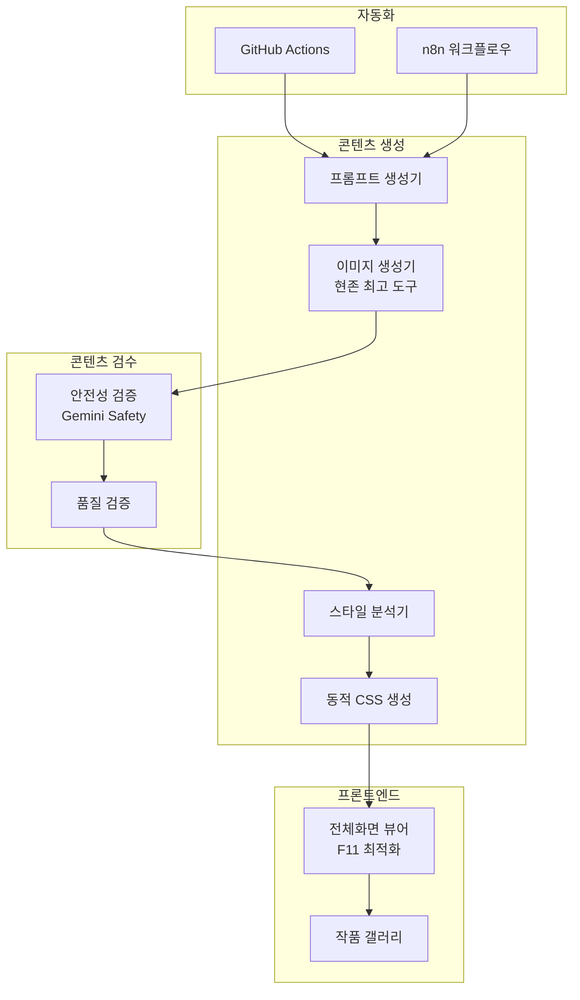

# 미디어 아트 자동화 웹 서비스 구현 계획서 (v2)

AI 기반 미디어 아트 자동 생성 및 전시 웹 서비스. 여러 가상 작가가 고유한 스타일로 **하루 1개의 고퀄리티 작품**을 생성하여 정적 웹페이지로 서비스합니다.

---

## 핵심 전략

| 항목 | 결정 |
|------|------|
| **작품 빈도** | 하루 1개 (희소성 + 비용 최적화) |
| **미디어 형식** | 하이브리드 (이미지 → 동적 CSS 애니메이션) |
| **이미지 생성** | 현존 최고 생성기 (교체 가능한 구조) |
| **자동화** | GitHub Actions 또는 n8n |
| **수익화 (1단계)** | 예술적 후원 UI (공공장소 친화적) |
| **수익화 (향후)** | 결제 시스템 (구조만 예비) |

---

## 시스템 아키텍처



---

## 미디어 형식 전략

이미지 생성 없이도 미디어 아트 구현 가능한 대안:

### Option A: 순수 코드 기반 (무료)
```javascript
// CSS/JS로 생성하는 제너러티브 아트
- CSS Gradients + Animations
- Canvas API + WebGL
- Three.js 3D 시각화
- P5.js 제너러티브 패턴
```

### Option B: AI 이미지 생성 (권장)
```javascript
// 현존 최고 이미지 생성기 (교체 가능한 구조)
const IMAGE_GENERATORS = {
  'gemini': 'Gemini 2.5 Flash Image (나노바나나)',  // 현재 최고
  'dall-e': 'DALL-E 3',
  'midjourney': 'Midjourney v6',
  'flux': 'Flux Pro',
  // ... 새로운 도구 추가 가능
};

// 설정으로 쉽게 교체
const CURRENT_GENERATOR = 'gemini';
```

### 하이브리드 방식 (선택)
```javascript
// 이미지 생성 → 작가별 애니메이션 추가
1. 나노바나나로 고품질 이미지 생성
2. 작가 프로필의 animation 설정에 따라 효과 적용
   - "subtle-float": 은은한 떠다니는 효과
   - "gentle-pulse": 부드러운 밝기 변화
   - "slow-zoom": 느린 확대/축소
   - "parallax": 레이어 분리 패럴렉스
3. WebGL 쉘이더로 실시간 효과 (선택)
```

---

## Proposed Changes

### 1. 프로젝트 구조

#### [NEW] [디렉토리 구조](file:///c:/Users/hiyon/Documents/media-art-writer)

```
media-art-writer/
├── index.html              # 작가 선택 페이지
├── viewer.html             # 전체화면 미디어 아트 뷰어
├── css/
│   ├── style.css           # 전역 스타일
│   └── animations.css      # 미디어 아트 애니메이션
├── js/
│   ├── gallery.js          # 갤러리 로직
│   ├── viewer.js           # 뷰어 로직
│   └── generative.js       # 제너러티브 아트 엔진
├── data/
│   ├── artists.json        # 작가 프로필
│   └── artworks/           # 작품 데이터
├── media/                  # 생성된 이미지/비디오
├── scripts/
│   └── generate.js         # 작품 생성 스크립트
└── .github/workflows/      # 자동화
```

---

### 2. 작가 시스템

#### [NEW] [artists.json](file:///c:/Users/hiyon/Documents/media-art-writer/data/artists.json)

```json
{
  "artists": [
    {
      "id": "aura-7",
      "name": "AURA-7",
      "nameKo": "아우라-7",
      "theme": "디지털 자연주의",
      "description": "빛과 자연의 순간을 포착하는 명상적 작품",
      "promptBase": "ethereal natural scene, soft diffused light, organic flowing shapes, bioluminescent elements, dreamlike atmosphere, 4K",
      "styleHints": {
        "dominantMood": "serene",
        "animationType": "gentle-pulse"
      }
    },
    {
      "id": "kuro-x", 
      "name": "KURO-X",
      "nameKo": "쿠로-엑스",
      "theme": "미니멀 기하학",
      "description": "공간과 형태, 빈 공간의 대화",
      "promptBase": "minimalist geometric composition, clean lines, high contrast, negative space, zen aesthetic, architectural precision",
      "styleHints": {
        "dominantMood": "contemplative",
        "animationType": "subtle-float"
      }
    },
    {
      "id": "neon-v",
      "name": "NEON-V", 
      "nameKo": "네온-브이",
      "theme": "사이버펑크 비전",
      "description": "네온 도시와 미래의 풍경",
      "promptBase": "cyberpunk cityscape, neon reflections, rain-slicked streets, holographic elements, blade runner aesthetic, 8K",
      "styleHints": {
        "dominantMood": "electric",
        "animationType": "slow-zoom"
      }
    },
    {
      "id": "flora-9",
      "name": "FLORA-9",
      "nameKo": "플로라-9",
      "theme": "초현실 식물학",
      "description": "상상 속 식물과 미지의 생태계",
      "promptBase": "surreal botanical illustration, impossible flowers, alien flora, scientific aesthetic, detailed texture, macro photography style",
      "styleHints": {
        "dominantMood": "mysterious",
        "animationType": "breathing"
      }
    },
    {
      "id": "echo-0",
      "name": "ECHO-0",
      "nameKo": "에코-제로",
      "theme": "추상 음향 시각화",
      "description": "소리와 리듬의 시각적 표현",
      "promptBase": "abstract sound visualization, audio waveforms, rhythm patterns, synesthesia art, flowing energy, vibrant gradients",
      "styleHints": {
        "dominantMood": "dynamic",
        "animationType": "wave-ripple"
      }
    }
  ]
}
```

---

### 3. 전체화면 뷰어

#### [NEW] [viewer.html](file:///c:/Users/hiyon/Documents/media-art-writer/viewer.html)

```
┌─────────────────────────────────────────────┐
│                                             │
│         [미디어 아트]                        │
│         (이미지/애니메이션/제너러티브)        │
│                                             │
├─────────────────────────────────────────────┤
│  Aurora Chen                                │
│  "숲속 새벽의 빛"                            │
│  ethereal forest dawn with bioluminescent...│
└─────────────────────────────────────────────┘
```

**기능:**
- F11 전체화면 최적화
- 자동 로테이션 (설정 가능)
- 부드러운 페이드 전환
- 다양한 미디어 타입 지원

---

### 3.1 제너러티브 아트 엔진 (Generative Engines)

각 작가의 테마에 맞는 시각 효과를 코드로 구현합니다.

#### 엔진 매핑 전략
| 작가 | 테마 | 엔진 타입 | 시각 효과 설명 |
|------|------|-----------|----------------|
| **AURA-7** | 자연 | `Organic` | 부드럽게 떠다니는 발광 입자, 유기적인 움직임 |
| **KURO-X** | 기하학 | `Geometric` | 천천히 회전하는 선과 도형, 보로노이 패턴 |
| **NEON-V** | 사이버펑크 | `Cyberpunk` | 디지털 그리드, 글리치 효과, 네온 비 |
| **FLORA-9** | 식물 | `Organic` | 프랙탈 패턴으로 자라나는 형상 (L-System 변형) |
| **ECHO-0** | 소리 | `Wave` | 사인파(Sine wave) 중첩, 주파수 시각화 |
| **VOID-3** | 우주 | `Cosmic` | 깊이감이 있는 별, 성운 효과, 느린 회전 |
| **TERRA-1** | 대지 | `Texture` | 노이즈 기반의 질감, 등고선 흐름 |
| **AQUA-5** | 심해 | `Wave` | 물결 효과 (Caustics), 유체 시뮬레이션 |
| **PRISM-2** | 빛 | `Prism` | 빛의 분산, 무지개 그라데이션, 프리즘 굴절 |

#### [NEW] [js/generative.js](file:///c:/Users/hiyon/Documents/media-art-writer/js/generative.js)
다형성을 활용한 엔진 구조:
```javascript
class ArtEngine {
    constructor(canvas, ctx) { ... }
    resize(width, height) { ... }
    update() { ... }
    draw() { ... }
}

class OrganicEngine extends ArtEngine { ... }
class GeometricEngine extends ArtEngine { ... }
// ...
```

---

### 4. 자동화 및 콘텐츠 검수

> [!IMPORTANT]
> **콘텐츠 안전성 검수 필수**
> 공공장소 노출 특성상, 부적절한 콘텐츠가 생성되면 치명적입니다.
> Gemini Safety 필터 + 추가 검증 로직으로 이중 검수합니다.

#### 콘텐츠 검수 프로세스

```javascript
// scripts/safety-check.js
async function validateContent(image, prompt) {
  // 1단계: Gemini Safety 필터 (이미지 생성 시 자동 적용)
  // 나노바나나는 기본적으로 안전 필터 내장
  
  // 2단계: 추가 키워드 검증
  const bannedPatterns = [
    /violence|blood|weapon/i,
    /nsfw|nude|explicit/i,
    // ... 추가 패턴
  ];
  
  // 3단계: 검증 실패 시 재생성 또는 건너뛰기
  if (!isSafe) {
    console.log('⚠️ 콘텐츠 검증 실패, 재생성 시도');
    return regenerate();
  }
  
  return { approved: true, image, prompt };
}
```

#### Option A: GitHub Actions

```yaml
# .github/workflows/generate.yml
name: Daily Art Generation
on:
  schedule:
    - cron: '0 9 * * *'  # 매일 오전 9시 (UTC)
  workflow_dispatch:

jobs:
  generate:
    runs-on: ubuntu-latest
    steps:
      - uses: actions/checkout@v4
      - uses: actions/setup-node@v4
      - run: npm install
      - run: node scripts/generate.js      # 이미지 생성
      - run: node scripts/safety-check.js  # 안전성 검수
      - run: node scripts/add-animation.js # 애니메이션 적용
      - uses: stefanzweifel/git-auto-commit-action@v5
```

#### Option B: n8n 워크플로우

```yaml
# 추천 구성
1. Schedule 트리거 (매일 1회)
2. 작가 랜덤 선택
3. 나노바나나 API 호출
4. 안전성 검수 (IF 노드)
5. 애니메이션 설정 적용
6. GitHub Push
```

---

### 5. 수익화 구조 (1단계) - 예술적 UI

> 카페, 사무실 등 공공장소에서도 자연스럽게 보이는 예술적 디자인

#### 후원 UI 컨셉

```
┌─────────────────────────────────────────────┐
│                                             │
│         [미디어 아트 작품]                   │
│                                             │
├─────────────────────────────────────────────┤
│  AURA-7                                     │
│  "숲속 새벽의 빛"                            │
│                                             │
│  ─────────────────────────────────────────  │
│                                             │
│  더 많은 작품을 보고싶다면                    │
│                                             │
└─────────────────────────────────────────────┘
```

#### 동적 CSS (프롬프트/이미지 분석 기반)

> 생성된 이미지와 프롬프트를 분석하여 CSS를 자동 생성

```javascript
// scripts/style-analyzer.js
async function analyzeAndGenerateStyle(image, prompt, artist) {
  // 1단계: 이미지 색상 추출 (Color Thief 또는 Gemini Vision)
  const dominantColors = await extractColors(image);
  
  // 2단계: 프롬프트에서 분위기 키워드 추출
  const moodKeywords = extractMoodFromPrompt(prompt);
  // "ethereal" → serene, "neon" → electric, "minimal" → calm
  
  // 3단계: 작가 힌트와 결합하여 최종 스타일 결정
  const style = {
    colors: dominantColors,
    mood: moodKeywords[0] || artist.styleHints.dominantMood,
    animation: artist.styleHints.animationType,
    font: selectFontByMood(moodKeywords),
    opacity: calculateOpacity(dominantColors)
  };
  
  return generateCSSVariables(style);
}

// 분위기별 폰트 매핑
const MOOD_FONTS = {
  serene: "'Noto Serif KR', serif",
  contemplative: "'Roboto Mono', monospace",
  electric: "'Orbitron', sans-serif",
  mysterious: "'Cormorant Garamond', serif",
  dynamic: "'Inter', sans-serif"
};
```

```css
/* 동적으로 생성되는 CSS 변수 */
:root {
  /* 이미지에서 추출한 색상 */
  --color-primary: /* 이미지 주요 색상 */;
  --color-accent: /* 이미지 강조 색상 */;
  --color-background: /* 이미지 배경 색상 */;
  
  /* 분위기에 맞는 폰트 */
  --font-display: /* 프롬프트 분석 결과 */;
  
  /* 색상 밝기에 따른 UI 투명도 */
  --ui-opacity: /* 자동 계산 */;
}

.artwork-overlay {
  background: linear-gradient(
    to top,
    color-mix(in srgb, var(--color-background) 80%, transparent),
    transparent
  );
  font-family: var(--font-display);
}
```

#### 후원 링크

```html
<footer class="support-section">
  <p class="support-message">더 많은 작품을 보고싶다면</p>
  <nav class="support-links">
    <a href="#" class="support-link">여기를 눌러주세요</a>
  </nav>
</footer>
```

---

### 6. 향후 결제 시스템 (구조만 예비)

> [!NOTE]  
> 수익성 확보 시 구현 예정. 현재는 구조만 준비.

```javascript
// 향후 구현 시 필요한 구조
// data/artworks/artist-id/works.json
{
  "works": [
    {
      "id": "2024-01-24",
      "accessLevel": "free",  // "free" | "preview" | "premium"
      "unlockPrice": null
    }
  ]
}

// 무료: 최근 7일
// 프리뷰: 7-30일 (흐리게 표시)
// 프리미엄: 30일 이상 (결제 필요)
```

---

## 기술 스택

| 구분 | 기술 |
|------|------|
| **프론트엔드** | HTML5, CSS3, Vanilla JS |
| **제너러티브** | Canvas API, CSS Animations |
| **이미지 생성** | 나노바나나 (Gemini 2.5 Flash Image) |
| **자동화** | GitHub Actions / n8n |
| **호스팅** | GitHub Pages (무료) |
| **수익화** | 예술적 후원 UI |

---

## 예상 비용

| 항목 | 비용 |
|------|------|
| 호스팅 | **무료** |
| 자동화 | **무료** (GitHub Actions) |
| 이미지 생성 | ~$0.30-1.20/월 (하루 1개) |
| 도메인 (선택) | 연 $10-15/개 |

> **월 총 예상: $1 미만** (이미지 생성만)

---

## MVP 구현 순서

1. ✅ 계획 수정 완료
2. ⏳ 기본 뷰어 구현 (정적)
3. 작가 프로필 시스템
4. 제너러티브 아트 (코드 기반) - **완료**
   - [x] `js/generative.js` 엔진 코어 구현
   - [x] `ParticleEngine` (Aura, Flora)
   - [x] `GeometricEngine` (Kuro)
   - [x] `CyberpunkEngine` (Neon)
   - [x] `WaveEngine` (Echo, Aqua, Terra)
   - [x] `CosmicEngine` (Void)
5. Gemini API 연동
6. 자동화 설정
7. 배포 및 테스트

---

## Verification Plan

### 1단계: 정적 뷰어 검증
```bash
npx serve .
# 브라우저에서 F11 전체화면 테스트
```

### 2단계: 제너러티브 아트 검증
- CSS 애니메이션 동작 확인
- Canvas 렌더링 확인

### 3단계: API 연동 검증
```bash
node scripts/generate.js --test
# 이미지 생성 및 저장 확인
```

### 4단계: 자동화 검증
- GitHub Actions 수동 트리거
- 커밋 및 배포 확인
