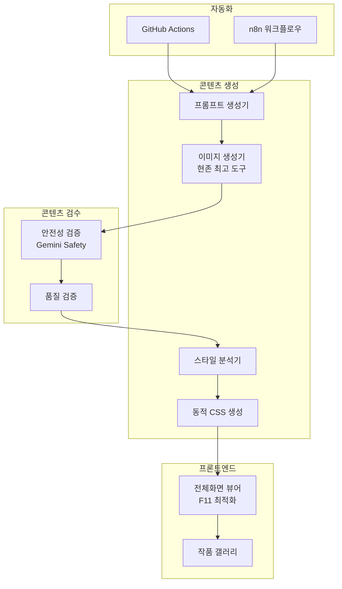
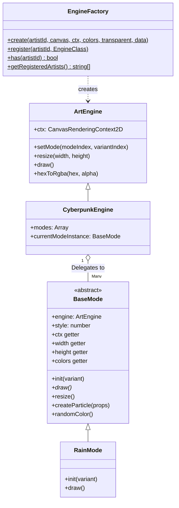

# 미디어 아트 자동화 웹 서비스 구현 설계서

AI 기반 미디어 아트 자동 생성 및 전시 웹 서비스. 여러 가상 작가가 고유한 스타일로 **하루 1개의 고퀄리티 작품**을 생성하여 정적 웹페이지로 서비스합니다.

---

## 핵심 전략

| 항목 | 결정 |
|------|------|
| **작품 빈도** | 하루 1개 (희소성 + 비용 최적화) |
| **미디어 형식** | 하이브리드 (이미지 → 동적 CSS 애니메이션) |
| **이미지 생성** | 현존 최고 생성기 (교체 가능한 구조) |
| **자동화** | GitHub Actions 또는 n8n |
| **수익화 (1단계)** | 예술적 후원 UI (공공장소 친화적) |
| **수익화 (향후)** | 결제 시스템 (구조만 예비) |

---

## 시스템 아키텍처



---

## 미디어 형식 전략

이미지 생성 없이도 미디어 아트 구현 가능한 대안:

### Option A: 순수 코드 기반 (무료)
```javascript
// CSS/JS로 생성하는 제너러티브 아트
- CSS Gradients + Animations
- Canvas API + WebGL
- Three.js 3D 시각화
- P5.js 제너러티브 패턴
```

### Option B: AI 이미지 생성 (권장)
```javascript
// 현존 최고 이미지 생성기 (교체 가능한 구조)
const IMAGE_GENERATORS = {
  'gemini': 'Gemini 2.5 Flash Image (나노바나나)',  // 현재 최고
  'dall-e': 'DALL-E 3',
  'midjourney': 'Midjourney v6',
  'flux': 'Flux Pro',
  // ... 새로운 도구 추가 가능
};

// 설정으로 쉽게 교체
const CURRENT_GENERATOR = 'gemini';
```

### 하이브리드 방식 (선택)
```javascript
// 이미지 생성 → 작가별 애니메이션 추가
1. 나노바나나로 고품질 이미지 생성
2. 작가 프로필의 animation 설정에 따라 효과 적용
   - "subtle-float": 은은한 떠다니는 효과
   - "gentle-pulse": 부드러운 밝기 변화
   - "slow-zoom": 느린 확대/축소
   - "parallax": 레이어 분리 패럴렉스
3. WebGL 쉘이더로 실시간 효과 (선택)
```

---

## Proposed Changes

### 1. 프로젝트 구조

#### [NEW] [디렉토리 구조](file:///c:/Users/hiyon/Documents/media-art-writer) (v3.1 Refactored)

```
media-art-writer/
├── index.html              # 작가 선택 페이지
├── viewer.html             # 전체화면 미디어 아트 뷰어
├── css/
│   ├── style.css           # 전역 스타일
│   └── animations.css      # 미디어 아트 애니메이션
├── js/
│   ├── gallery.js          # 갤러리 로직
│   ├── viewer.js           # 뷰어 컨트롤러 (EngineFactory 사용)
│   ├── core/               # [NEW] 핵심 추상화 모듈
│   │   ├── index.js        # Core exports
│   │   ├── BaseMode.js     # Mode 기본 클래스 (추상)
│   │   └── EngineFactory.js # Engine Factory (Registry Pattern)
│   ├── utils/              # [NEW] 유틸리티 함수
│   │   ├── index.js        # Utils exports
│   │   ├── colors.js       # 색상 변환 유틸리티
│   │   └── math.js         # 수학 유틸리티
│   └── engines/            # 제너러티브 아트 엔진 (Strategy Pattern)
│       ├── ArtEngine.js    # Engine Base Class
│       ├── CyberpunkEngine.js
│       ├── OrganicEngine.js
│       ├── GeometricEngine.js
│       ├── CosmicEngine.js
│       ├── BloomEngine.js
│       ├── FlowEngine.js
│       ├── WaveEngine.js
│       ├── ContourEngine.js
│       ├── RefractionEngine.js
│       └── modes/          # 엔진별 모드 구현체 (BaseMode 상속)
│           ├── cyberpunk/
│           ├── organic/
│           ├── geometric/
│           ├── cosmic/
│           ├── bloom/
│           ├── flow/
│           ├── wave/
│           ├── contour/
│           └── refraction/
├── data/
│   ├── artists.json        # 작가 프로필
│   └── artworks/           # 작품 데이터
├── media/                  # 생성된 이미지/비디오
├── scripts/
│   └── generate.js         # 작품 생성 스크립트
└── .github/workflows/      # 자동화
```

---

### 2. 작가 시스템
<...중략...>

### 3.2 엔진 아키텍처 개선 (v3.1 Refactored)

> **전략 패턴 (Strategy Pattern) + Factory Pattern + BaseMode 추상 클래스 도입**:
> 모든 엔진은 이제 EngineFactory를 통해 생성되고, 모든 모드는 BaseMode를 상속합니다.

#### 아키텍처 다이어그램


#### 주요 개선 사항 (v3.1)

| 개선 항목 | 설명 |
|----------|------|
| **EngineFactory** | 작가 ID 기반 엔진 자동 생성 (Registry Pattern) |
| **BaseMode** | 모든 Mode의 추상 기본 클래스 (인터페이스 강제) |
| **Utils 모듈** | `hexToRgba`, `random`, `lerp` 등 공통 유틸리티 분리 |
| **Getter 속성** | Mode에서 `this.ctx`, `this.width` 등 간결한 접근 |

#### 리팩토링 효과
1. **모듈화 (Modularity)**: `RainMode.js`, `ScannerMode.js` 등 각 모드가 별도 파일로 분리.
2. **확장성 (Extensibility)**: 새 엔진 추가 시 EngineFactory에 등록만 하면 됨.
3. **재사용성 (Reusability)**: BaseMode의 헬퍼 메서드 (`createParticle`, `randomColor`) 활용.
4. **타입 안전성**: 추상 클래스로 인터페이스 강제 (draw 미구현 시 에러).

#### 표준 모드 인터페이스 (BaseMode 상속)

```javascript
// Example: js/engines/modes/flow/BubbleMode.js
import { BaseMode } from '../../../core/BaseMode.js';

export class BubbleMode extends BaseMode {
    constructor(engine) {
        super(engine);  // 필수: 부모 생성자 호출
        this.bubbles = [];
    }

    init(variant = 0) {
        super.init(variant);  // style 설정
        // BaseMode의 헬퍼 메서드 활용
        this.bubbles = Array.from({ length: 30 }, () =>
            this.createParticle({
                radius: Math.random() * 10 + 2,
                speed: Math.random() * 1 + 0.5
            })
        );
    }

    draw() {
        // Getter 사용: this.ctx, this.width, this.height, this.frame
        this.bubbles.forEach(b => {
            b.y -= b.speed;
            this.ctx.beginPath();
            this.ctx.arc(b.x, b.y, b.radius, 0, Math.PI * 2);
            this.ctx.fillStyle = this.hexToRgba(b.color, 0.6);
            this.ctx.fill();
        });
    }
}
```

#### EngineFactory 사용법

```javascript
// viewer.js에서 사용
import { EngineFactory } from './core/EngineFactory.js';

// 작가 ID로 적절한 엔진 자동 생성
this.engine = EngineFactory.create(
    artist.id,      // 'aqua-5' → FlowEngine
    this.canvas,
    this.ctx,
    colors,
    this.hasBackgroundImage,
    this.dailyArtwork
);

// 새 엔진 등록 (확장 시)
EngineFactory.register('new-artist', NewEngine);
```

---

## 기술 스택

| 구분 | 기술 |
|------|------|
| **프론트엔드** | HTML5, CSS3, Vanilla JS |
| **제너러티브** | Canvas API, CSS Animations |
| **이미지 생성** | 나노바나나 (Gemini 2.5 Flash Image) |
| **자동화** | GitHub Actions / n8n |
| **호스팅** | GitHub Pages (무료) |
| **수익화** | 예술적 후원 UI |

---

## 예상 비용

| 항목 | 비용 |
|------|------|
| 호스팅 | **무료** |
| 자동화 | **무료** (GitHub Actions) |
| 이미지 생성 | ~$0.30-1.20/월 (하루 1개) |
| 도메인 (선택) | 연 $10-15/개 |

> **월 총 예상: $1 미만** (이미지 생성만)

---

## MVP 구현 순서

1. ✅ 계획 수정 완료
2. ⏳ 기본 뷰어 구현 (정적)
3. 작가 프로필 시스템
4. 제너러티브 아트 (코드 기반) - **완료**
   - [x] `js/generative.js` 엔진 코어 구현
   - [x] `ParticleEngine` (Aura, Flora)
   - [x] `GeometricEngine` (Kuro)
   - [x] `CyberpunkEngine` (Neon)
   - [x] `WaveEngine` (Echo, Aqua, Terra)
   - [x] `CosmicEngine` (Void)
5. Gemini API 연동
6. 자동화 설정
7. 배포 및 테스트

---

## Verification Plan

### 1단계: 정적 뷰어 검증
```bash
npx serve .
# 브라우저에서 F11 전체화면 테스트
```

### 2단계: 제너러티브 아트 검증
- CSS 애니메이션 동작 확인
- Canvas 렌더링 확인

### 3단계: API 연동 검증
```bash
node scripts/generate.js --test
# 이미지 생성 및 저장 확인
```

### 4단계: 자동화 검증
- GitHub Actions 수동 트리거
- 커밋 및 배포 확인
