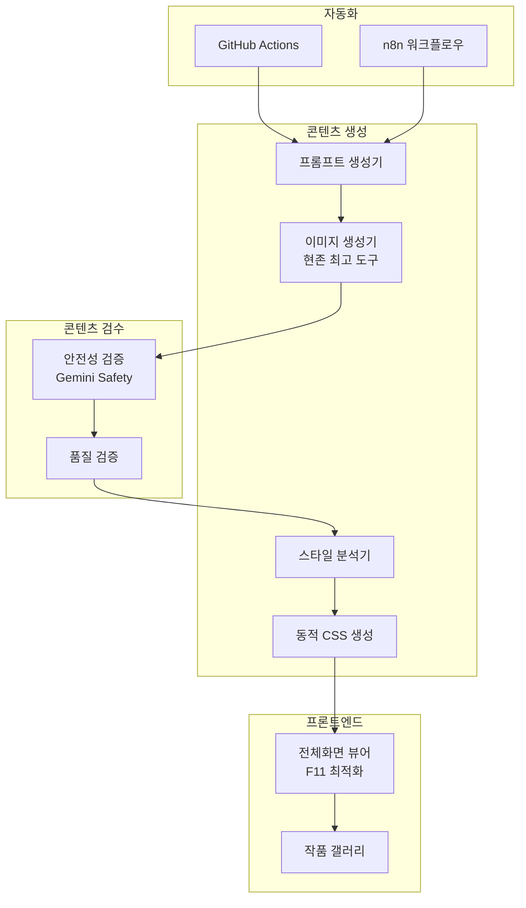
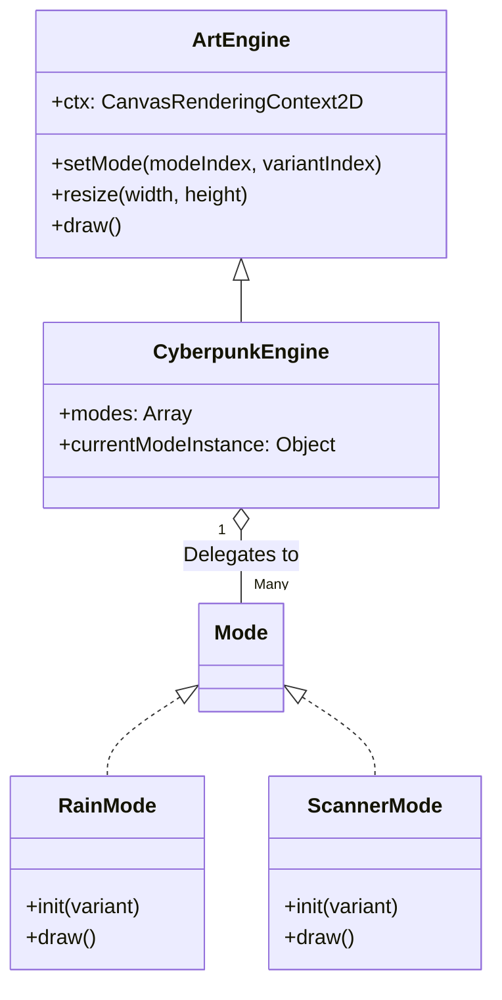

# 미디어 아트 자동화 웹 서비스 구현 설계서

AI 기반 미디어 아트 자동 생성 및 전시 웹 서비스. 여러 가상 작가가 고유한 스타일로 **하루 1개의 고퀄리티 작품**을 생성하여 정적 웹페이지로 서비스합니다.

---

## 핵심 전략

| 항목 | 결정 |
|------|------|
| **작품 빈도** | 하루 1개 (희소성 + 비용 최적화) |
| **미디어 형식** | 하이브리드 (이미지 → 동적 CSS 애니메이션) |
| **이미지 생성** | 현존 최고 생성기 (교체 가능한 구조) |
| **자동화** | GitHub Actions 또는 n8n |
| **수익화 (1단계)** | 예술적 후원 UI (공공장소 친화적) |
| **수익화 (향후)** | 결제 시스템 (구조만 예비) |

---

## 시스템 아키텍처



---

## 미디어 형식 전략

이미지 생성 없이도 미디어 아트 구현 가능한 대안:

### Option A: 순수 코드 기반 (무료)
```javascript
// CSS/JS로 생성하는 제너러티브 아트
- CSS Gradients + Animations
- Canvas API + WebGL
- Three.js 3D 시각화
- P5.js 제너러티브 패턴
```

### Option B: AI 이미지 생성 (권장)
```javascript
// 현존 최고 이미지 생성기 (교체 가능한 구조)
const IMAGE_GENERATORS = {
  'gemini': 'Gemini 2.5 Flash Image (나노바나나)',  // 현재 최고
  'dall-e': 'DALL-E 3',
  'midjourney': 'Midjourney v6',
  'flux': 'Flux Pro',
  // ... 새로운 도구 추가 가능
};

// 설정으로 쉽게 교체
const CURRENT_GENERATOR = 'gemini';
```

### 하이브리드 방식 (선택)
```javascript
// 이미지 생성 → 작가별 애니메이션 추가
1. 나노바나나로 고품질 이미지 생성
2. 작가 프로필의 animation 설정에 따라 효과 적용
   - "subtle-float": 은은한 떠다니는 효과
   - "gentle-pulse": 부드러운 밝기 변화
   - "slow-zoom": 느린 확대/축소
   - "parallax": 레이어 분리 패럴렉스
3. WebGL 쉘이더로 실시간 효과 (선택)
```

---

## Proposed Changes

### 1. 프로젝트 구조

#### [NEW] [디렉토리 구조](file:///c:/Users/hiyon/Documents/media-art-writer)

```
media-art-writer/
├── index.html              # 작가 선택 페이지
├── viewer.html             # 전체화면 미디어 아트 뷰어
├── css/
│   ├── style.css           # 전역 스타일
│   └── animations.css      # 미디어 아트 애니메이션
├── js/
│   ├── gallery.js          # 갤러리 로직
│   ├── viewer.js           # 뷰어 로직
│   └── engines/            # เจ너러티브 아트 엔진 (Strategy Pattern)
│       ├── ArtEngine.js    # Base Class
│       ├── CyberpunkEngine.js
│       ├── OrganicEngine.js
│       ├── GeometricEngine.js
│       ├── CosmicEngine.js
│       ├── BloomEngine.js
│       ├── FlowEngine.js
│       ├── WaveEngine.js
│       ├── ContourEngine.js
│       ├── RefractionEngine.js
│       └── modes/          # 엔진별 모드 구현체 (독립 파일)
│           ├── cyberpunk/
│           ├── organic/
│           ├── geometric/
│           ├── cosmic/
│           ├── bloom/
│           ├── flow/
│           ├── wave/
│           ├── contour/
│           └── refraction/
├── data/
│   ├── artists.json        # 작가 프로필
│   └── artworks/           # 작품 데이터
├── media/                  # 생성된 이미지/비디오
├── scripts/
│   └── generate.js         # 작품 생성 스크립트
└── .github/workflows/      # 자동화
```

---

### 2. 작가 시스템
<...중략...>

### 3.2 엔진 아키텍처 개선 (Completed)

> **전략 패턴 (Strategy Pattern) 도입 완료**: 
> 모든 엔진은 이제 거대한 `switch` 문 대신, 개별 모드를 독립된 클래스 파일로 관리합니다.

#### 아키텍처 다이어그램


#### 리팩토링 효과
1. **모듈화 (Modularity)**: `RainMode.js`, `ScannerMode.js` 등 각 모드가 별도 파일로 분리되어 코드가 깔끔해짐.
2. **확장성 (Extensibility)**: 새로운 모드를 추가할 때 메인 엔진 코드를 거의 수정하지 않아도 됨.
3. **재사용성 (Reusability)**: `PointMode`나 `BubbleMode` 처럼, 특정 모드 로직을 다른 엔진에서 쉽게 재사용하거나 조합 가능.

#### 표준 모드 인터페이스
모든 모드 클래스는 아래 인터페이스를 준수해야 합니다:

```javascript
// Example: js/engines/modes/cyberpunk/RainMode.js
export class RainMode {
    constructor(engine) {
        this.engine = engine; // 엔진 인스턴스(Context) 참조
    }

    // 모드 초기화 (변종 변경 시 호출)
    init(variant) {
        this.variant = variant;
        // ... 리소스 초기화
    }

    // 매 프레임 그리기
    draw() {
        // this.engine.ctx 를 사용하여 렌더링
    }
    
    // (Optional) 상태 업데이트
    update() {
        // ... 위치 계산 등
    }
}
```

---

## 기술 스택

| 구분 | 기술 |
|------|------|
| **프론트엔드** | HTML5, CSS3, Vanilla JS |
| **제너러티브** | Canvas API, CSS Animations |
| **이미지 생성** | 나노바나나 (Gemini 2.5 Flash Image) |
| **자동화** | GitHub Actions / n8n |
| **호스팅** | GitHub Pages (무료) |
| **수익화** | 예술적 후원 UI |

---

## 예상 비용

| 항목 | 비용 |
|------|------|
| 호스팅 | **무료** |
| 자동화 | **무료** (GitHub Actions) |
| 이미지 생성 | ~$0.30-1.20/월 (하루 1개) |
| 도메인 (선택) | 연 $10-15/개 |

> **월 총 예상: $1 미만** (이미지 생성만)

---

## MVP 구현 순서

1. ✅ 계획 수정 완료
2. ⏳ 기본 뷰어 구현 (정적)
3. 작가 프로필 시스템
4. 제너러티브 아트 (코드 기반) - **완료**
   - [x] `js/generative.js` 엔진 코어 구현
   - [x] `ParticleEngine` (Aura, Flora)
   - [x] `GeometricEngine` (Kuro)
   - [x] `CyberpunkEngine` (Neon)
   - [x] `WaveEngine` (Echo, Aqua, Terra)
   - [x] `CosmicEngine` (Void)
5. Gemini API 연동
6. 자동화 설정
7. 배포 및 테스트

---

## Verification Plan

### 1단계: 정적 뷰어 검증
```bash
npx serve .
# 브라우저에서 F11 전체화면 테스트
```

### 2단계: 제너러티브 아트 검증
- CSS 애니메이션 동작 확인
- Canvas 렌더링 확인

### 3단계: API 연동 검증
```bash
node scripts/generate.js --test
# 이미지 생성 및 저장 확인
```

### 4단계: 자동화 검증
- GitHub Actions 수동 트리거
- 커밋 및 배포 확인
